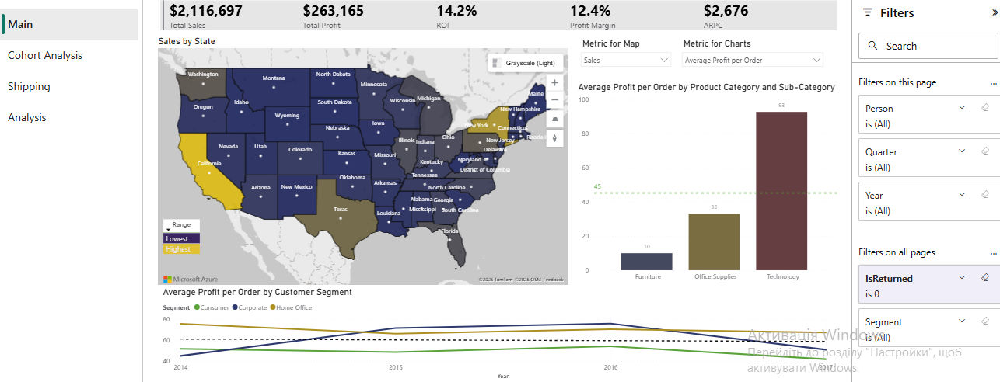
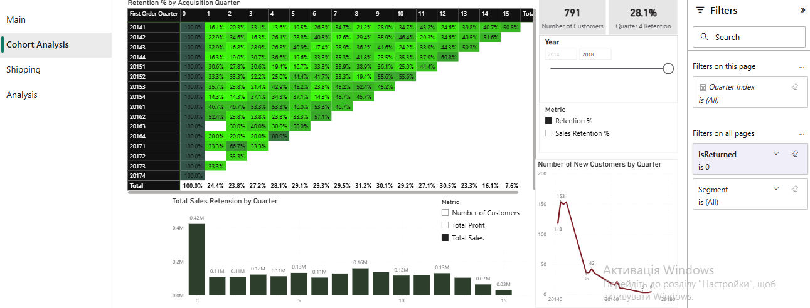
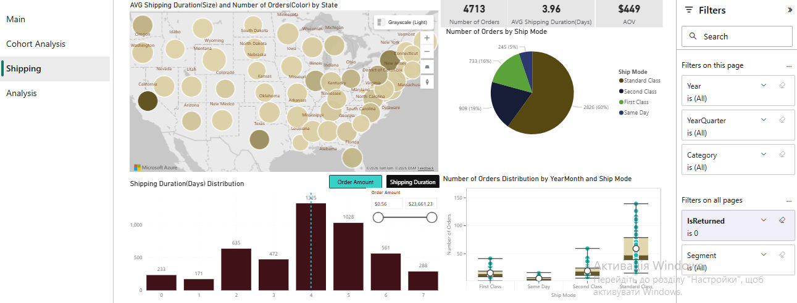
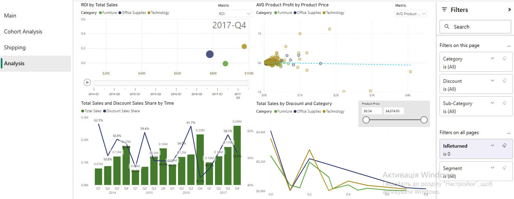
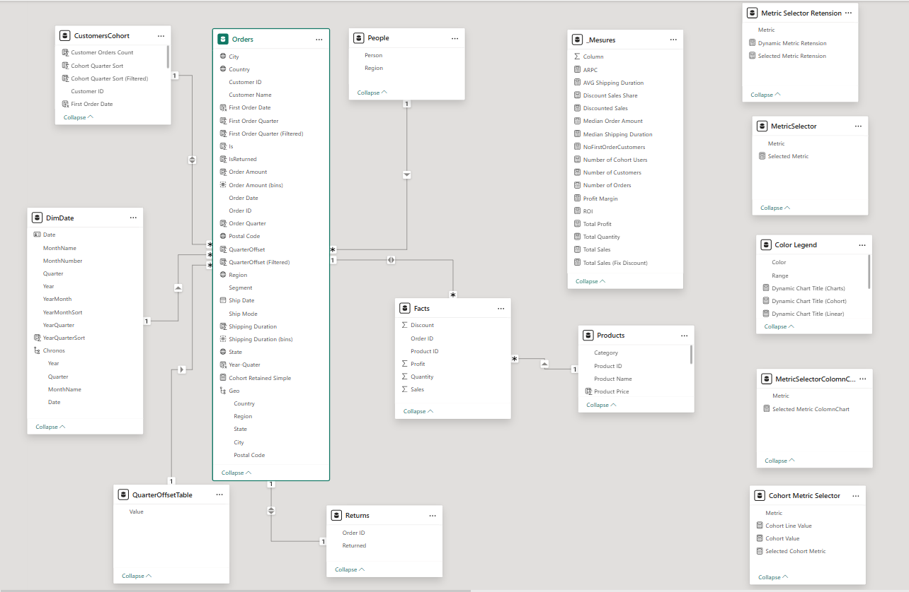

# Superstore-Power_BI_Project :rocket:

Welcome to the GitHub repository for my Power BI project - a Superstore Report!


--------------------------------------------------------------------------------------------------------------------------------------------

--------------------------------------------------------------------------------------------------------------------------------------------

--------------------------------------------------------------------------------------------------------------------------------------------

--------------------------------------------------------------------------------------------------------------------------------------------

## Data Source Description 📂  

Superstore Sales is a training dataset bundled with Tableau. It is not a real-world dataset but a realistic simulation of a retail company operating in the US. The dataset covers Furniture, Office Supplies, and Technology products and includes all standard business metrics:\
Financials: Sales, profit, and discount rates.\
Geography: US-wide coverage by region and state.\
Product Hierarchy: Categories and sub-categories.\
Customers: Segmentation across different consumer groups.

Explore dataset: [sales_-_superstore.xls](https://docs.google.com/spreadsheets/d/1RlxeN4dHwR_3FipNgZaSrGWBRFVzsfqU/edit?usp=sharing&ouid=116604388688316802165&rtpof=true&sd=true)

## Data Modelling Process ⚒️

Based on the sample_-_superstore.xls dataset (Orders, People, Returns), I performed data normalization by decomposing the main Orders table into Facts, Orders, and Products(it was not possible to separate information about customers into a separate table, since one customer has orders from different states and cities). This optimization enhances query performance and minimizes memory usage. The model features a CustomersCohort table for cohort analysis, a DimDate calendar for time intelligence, and several DISCONNECTED TABLES used for dynamic headers and metric-switching slicers.



## DAX Formulas 💼

DAX allowed me to calculate aggregated measures, perform cohort analysis, and generate trend analyses. Some examples:

<details>
<summary>Share of sales with discount</summary>

```  
Discount Sales Share =
DIVIDE(
    [Discounted Sales], 
    CALCULATE(
        [Total Sales],
        ALL(Facts[Discount])
    )
)
```
</details>

<details>
<summary>Retention</summary>

```
RetentionFiltered % =
VAR currentCohort = SELECTEDVALUE(Orders[First Order Quarter (Filtered)])
VAR currentOffset = SELECTEDVALUE(Orders[QuarterOffset (Filtered)])
VAR cohortCustomers =
    CALCULATETABLE(
        VALUES(Orders[Customer ID]),
        Orders[First Order Quarter (Filtered)] = currentCohort,
        Orders[QuarterOffset (Filtered)] = 0,
        Orders[IsReturned] = 0
    )
VAR activeCustomers =
    CALCULATETABLE(
        VALUES(Orders[Customer ID]),
        Orders[First Order Quarter (Filtered)] = currentCohort,
        Orders[QuarterOffset (Filtered)] = currentOffset,
        Orders[IsReturned] = 0
    )
RETURN
DIVIDE(
    COUNTROWS(INTERSECT(cohortCustomers, activeCustomers)),
    COUNTROWS(cohortCustomers)
)
```
</details>
